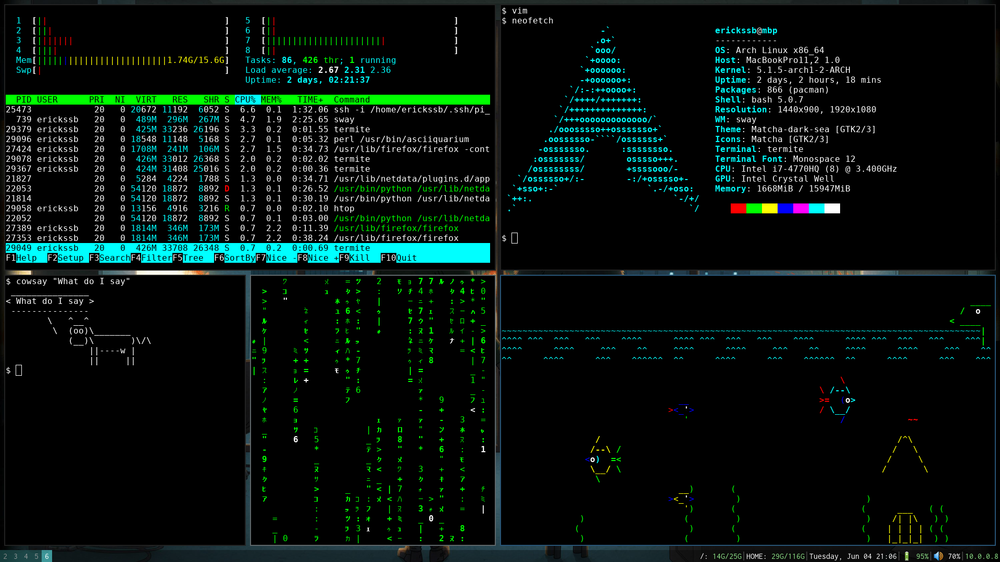
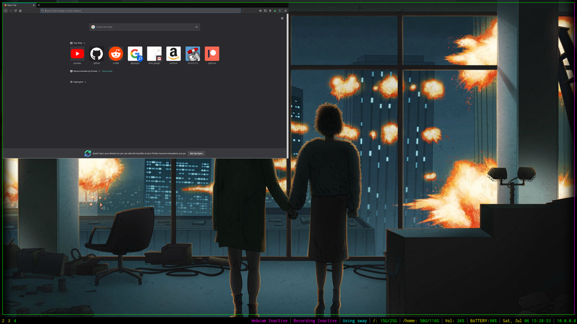

DOTFILES [SWAYWM]
================= 
My current dotfiles to recreate my development environment. This project is
currently on hold, as I am running macOS on my laptop right now for school, and
I am looking at reviving this project with some automatic install scripts. The
dotfiles themselves will not change much, but the way Arch Linux is installed
and configured will be. This project is and always was to serve as an
example/tutorial for how to get started with the "ricing" of an operating
system as an introduction to the more advanced side of Linux as a desktop. As
my knowledge of operating systems and the command line evolve, this repository
will follow suit. 



Features
--------

**Moderatly minimal install:**
Not quite [suckless](https://suckless.org) Level, but minimal enough to
lightweight, quick to install, while still having applications accomplish
everyday tasks. 

**Notifications with icons for system information:**
Information about system functions will be presented in the form of
notifications. Most, if not all key-bindings will notify you of any background
processes, or if anything has gone wrong.


**Organized for easy tinkering:**
It can be a pain when your configuration files and programs are scattered across
your hard drive, the current file tree map is as follows:
```
├── .bash_profile				Links to .bashrc
├── .bashrc						Bash configuration file
├── .config/					Containes most applicaions configuration files	
│   ├── aliasrc					All bash aliases
│   ├── i3blocks/
│   │   └── scripts/			Containes all scripts related to statusbar
│	│ 								functions
│   ├── wallpaper.png			Symlinked to the selected background image in
│									~/.config/wallpapers
├── .local/
│   ├── share/
│ 	│ 	└── .icons/				Contains all icons used for notifications
│   ├── bin/					Contains all executables, listed in $PATH
│   └── misc/
│       ├── install-scripts/	Contains various scripts used to install things
│		│ 							that may be considered useful.
│       └── systemd-files/		Contains all custom service for systemd
├── .profile:					Links to .bashrc
└── README.md:					This document.
```

Install
-------
**Fresh install of Arch linux:** clone the repository into your home folder
```
git clone https://github.com/samerickson/dotfiles.git /home/$USER
```
*It is probably safer to clone the repository then copy the files into home.*


Issues
------
**firefox:**
`Firefox` has way to many issues, for example below is an image of how firefox's
window sizing on startup is broken. 

Links related to the issue:

* https://www.reddit.com/r/firefox/comments/624pjf/tiling_window_managersfirefox_screen_messed_up/
* https://github.com/xmonad/xmonad/issues/144
* https://bugzilla.mozilla.org/show_bug.cgi?id=686747

`Firefox` also produces sesuire inducing visuals while trying to resize. As much
as I would like to use `firefox` its just too broken for me to justify it. Even
though `chromium` does not officially support `wayland`, it still appears to be the
better option, as lots of other apps used are ran using `xwayland` anyway.

Documentation
-------------
The man pages are usually the best place to go as community support with swaywm
are limited, except for asking your questions on 
[reddit](https://www.reddit.com/r/swaywm) or the *#sway* IRC channel, there are
very few forms online detailing issues that users have had and how to fix them.
This may be a good thing though, as it forces you to get used to reading
documentation and troubleshooting for yourself.

Here are some useful links for learning about what you can do with sway:
https://www.mankier.com/5/sway

Tests
-----
In the tests directory are a collection of scripts that can be used to easily
create a VirtualBox environment for testing this project. 

Create a new VirtualBox instance with 25GB hard disk, run selecting an
[arch-linux.iso](https://www.archlinux.org/download/) as the disk image. 
Then run one of the following commands:
```
# Use regular partitions
wget https://git.io/Je7hh

# Use logical volumes
wget https://git.io/Je7jk
```

**Minified URL to chroot.sh:** 
```
https://git.io/Je7hx
```

**Minified URL to arch-vbox.sh:**
```
https://git.io/Je7hh
```

**Minified URL to arch-vbox-lvm.sh**
```
https://git.io/Je7jk
```

The above URL's were shortened using [git.io](https://git.io). Eventually there
will be more automatic tests that can be conducted.

Wacom drawing tablets
---------------------
Wacom tablets work in sway, though you need to compile the driver from source
as there are some current issues with the version in the arch repositories
for some reason.

[Issue thread on StackExchange](https://askubuntu.com/questions/1063779/my-wacom-one-device-is-not-working)


[Installing input wacom from source](https://github.com/linuxwacom/input-wacom/wiki/Installing-input-wacom-from-source)

